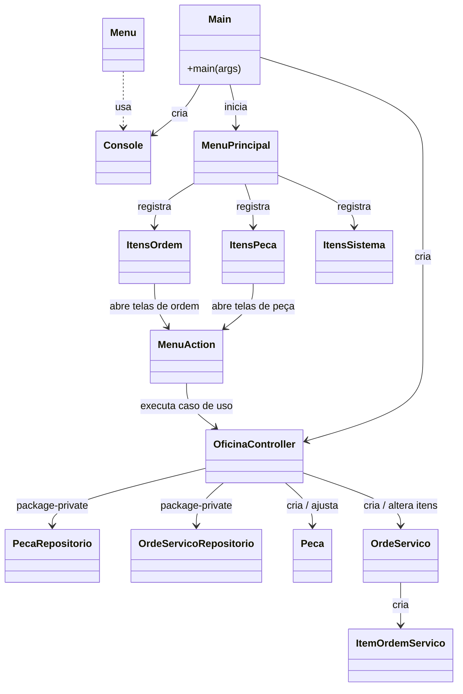
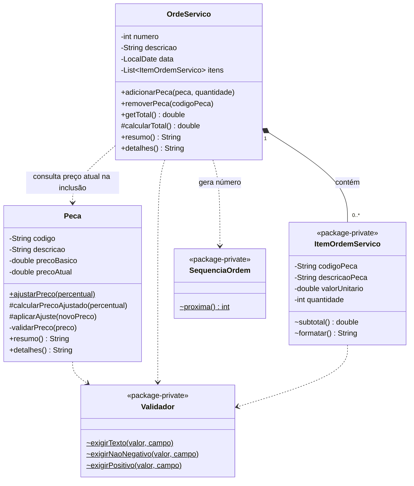
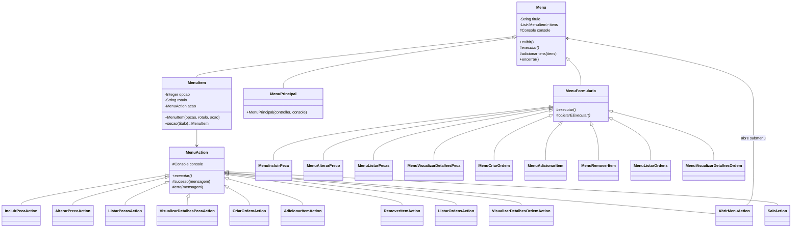
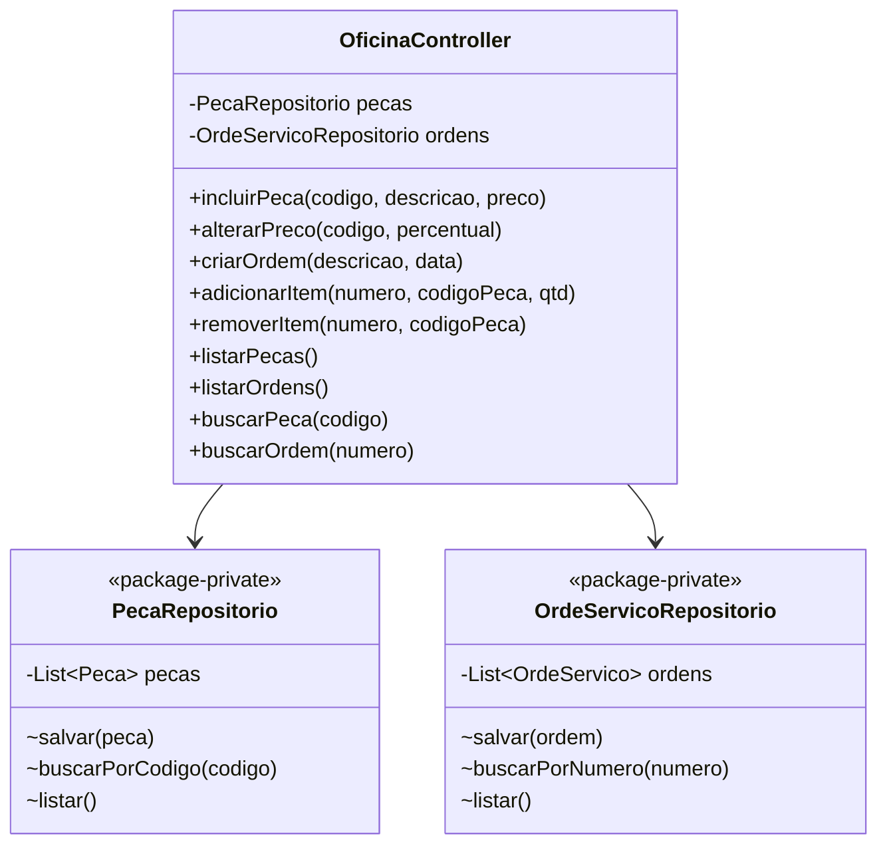
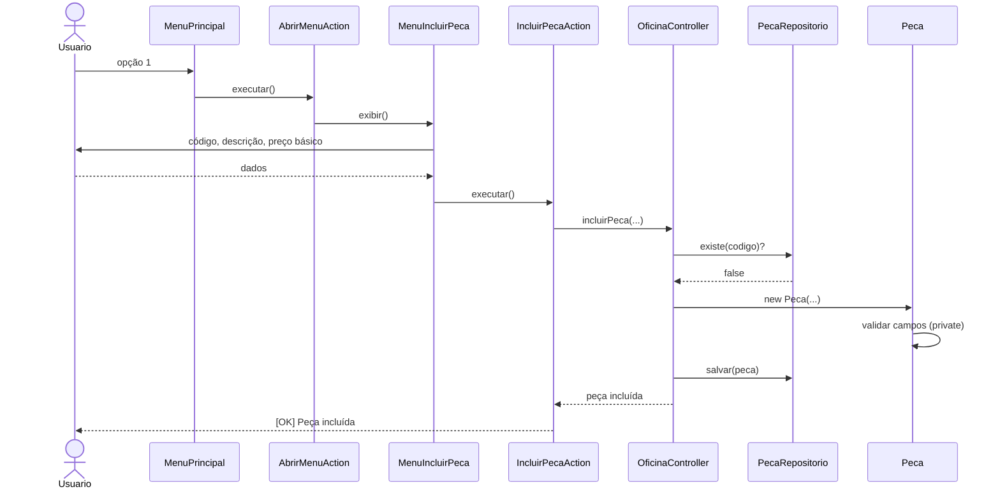
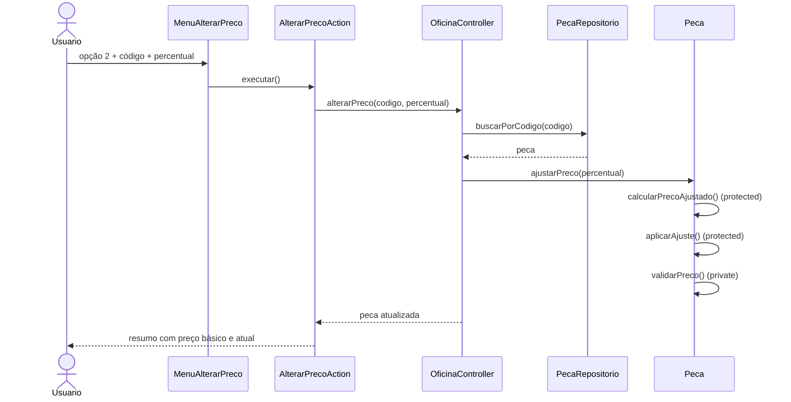
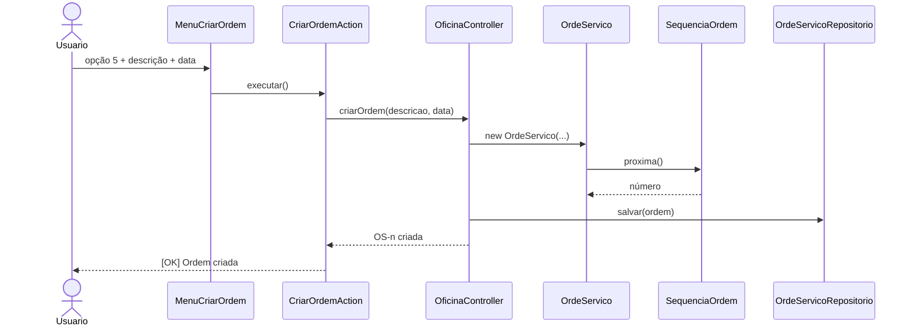
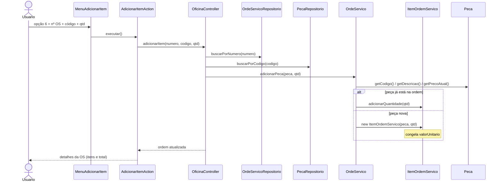
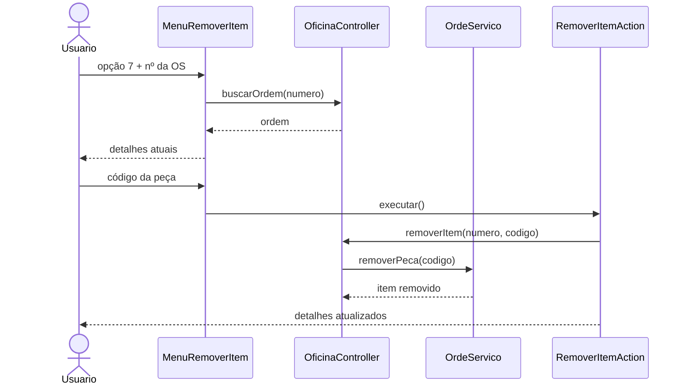
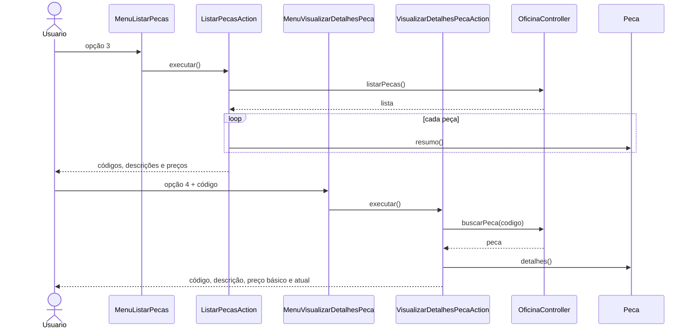

# Oficina — orientação a objetos em Java

Aplicação de terminal para cadastro de **peças** e **ordens de serviço**. O objetivo é demonstrar orientação a objetos com **SOLID**, **GRASP** e os **quatro modificadores de acesso** do Java (`public`, `protected`, `private` e package-private).

## Como executar

No IntelliJ, rode a classe `Main`.

Pelo terminal, a partir da raiz do projeto:

```bash
javac -encoding UTF-8 -d out -sourcepath src $(find src -name "*.java")
java -cp out Main
```

No PowerShell:

```powershell
$files = Get-ChildItem -Path src -Recurse -Filter *.java | ForEach-Object { $_.FullName }
javac -encoding UTF-8 -d out -sourcepath src $files
java -cp out Main
```

## Menu

```
--- Peças ---
1 - Incluir nova peça
2 - Alterar preço de peça
3 - Listar peças
4 - Visualizar detalhes de peça

--- Ordens de serviço ---
5 - Criar ordem de serviço
6 - Adicionar peça à ordem de serviço
7 - Remover peça da ordem de serviço
8 - Listar ordens de serviço
9 - Visualizar detalhes de ordem de serviço

--- Sistema ---
0 - Sair
```

As listas ficam **em memória** (não há banco de dados). O preço da peça é ajustado por comportamento (`ajustarPreco`), não por setter. Ao incluir uma peça na ordem, o valor unitário é **congelado** naquele momento.

## Estrutura do projeto

```
src/
  Main.java                         ponto de entrada
  dominio/                          regras de negócio
    Peca.java
    OrdeServico.java
    ItemOrdemServico.java           package-private
    Validador.java                  package-private
    Formatador.java                 package-private
    SequenciaOrdem.java             package-private
  oficina/                          orquestração e persistência em memória
    OficinaController.java          público (API da aplicação)
    PecaRepositorio.java            package-private
    OrdeServicoRepositorio.java     package-private
  infra/
    Console.java                    leitura/escrita do terminal
  menu/                             framework de menu
    Menu.java
    MenuFormulario.java
    MenuAction.java
    MenuItem.java
    MenuPrincipal.java              só registra os itens por domínio
    acao/                           ações isoladas (Command)
      AbrirMenuAction.java
      SairAction.java
      peca/
      ordem/
    item/                           telas e montagem das opções
      VisualizacaoOficina.java
      peca/
      ordem/
      sistema/
```

| Pacote | Responsabilidade |
|---|---|
| `dominio` | Entidades e regras. Information Expert: `Peca` conhece o preço; `OrdeServico` conhece itens e totais. |
| `oficina` | GRASP Controller. Menus não acessam repositórios; só o controller. |
| `menu` | Navegação e Template Method (`Menu` / `MenuFormulario`). |
| `menu.acao.*` | Uma classe por operação (SRP). |
| `menu.item.*` | Uma tela por operação; `ItensPeca`, `ItensOrdem` e `ItensSistema` montam as opções. |
| `infra` | Isola o `Scanner` (Pure Fabrication). |

O `MenuPrincipal` não conhece cada tela: ele só adiciona o que cada domínio entrega.

```java
adicionarItens(ItensPeca.criar(controller, console));
adicionarItens(ItensOrdem.criar(controller, console));
adicionarItens(ItensSistema.criar(this, console));
```

## Modificadores de acesso

| Modificador | Onde aparece | Por quê |
|---|---|---|
| `private` | Campos de `Peca` e `OrdeServico`, `validarPreco()`, busca interna do `Menu` | Encapsulamento: o estado não vaza. |
| `public` | `Menu.exibir()`, `Peca.ajustarPreco()`, `OficinaController` | Contrato entre pacotes. |
| `protected` | `Menu.executar()`, `Peca.calcularPrecoAjustado()`, `MenuAction.sucesso()` | Ganchos para especialização por herança. |
| package-private | `ItemOrdemServico`, `Validador`, repositórios | Visível só no pacote. Outros pacotes veem a ordem pelo método `detalhes()`. |

## SOLID e GRASP (resumo)

- **SRP**: menu pergunta, action executa, controller orquestra, entidade calcula.
- **OCP**: nova operação = novo `MenuFormulario` + nova `MenuAction`, sem alterar `Menu`.
- **LSP**: qualquer `Menu` responde a `exibir()`; qualquer `MenuAction` responde a `executar()`.
- **DIP**: menus dependem do controller, não dos repositórios.
- **Information Expert**: total na `OrdeServico`, preço na `Peca`.
- **Creator**: a ordem cria seus `ItemOrdemServico`.
- **Controller / Indirection**: `OficinaController` isola a memória das telas.

---

## Diagrama de classes UML

### Visão geral dos pacotes



### Domínio



`ItemOrdemServico` guarda uma **cópia** do código, da descrição e do valor unitário no instante da inclusão. Mudanças posteriores no preço da peça não alteram ordens já existentes.

### Menu e actions



### Controller e repositórios



Classes fora do pacote `oficina` **não compilam** se tentarem usar os repositórios: eles são package-private.

---

## Diagramas de sequência das principais operações

Fluxo comum de toda opção do menu:

1. `MenuPrincipal` recebe o número.
2. `AbrirMenuAction` abre o menu especializado.
3. O `MenuFormulario` coleta os dados.
4. A `MenuAction` correspondente chama o `OficinaController`.
5. O controller aplica a regra e persiste em memória.

### 1. Incluir nova peça



### 2. Alterar preço de peça

O percentual pode ser positivo (aumento) ou negativo (desconto). O cálculo e a validação ficam na `Peca`.



### 3. Criar ordem de serviço



### 4. Adicionar peça à ordem de serviço

O valor cobrado é o `precoAtual` da peça **no momento da inclusão**.



### 5. Remover peça da ordem de serviço



### 6. Listar e visualizar detalhes

Listagens pedem o **resumo**. A visualização pede um identificador e mostra o **detalhe** completo (Information Expert na própria entidade).



O fluxo de **listar / detalhar ordem** (opções 8 e 9) é o mesmo, trocando `Peca` por `OrdeServico` (`resumo()` e `detalhes()` com peças, valores e total).
